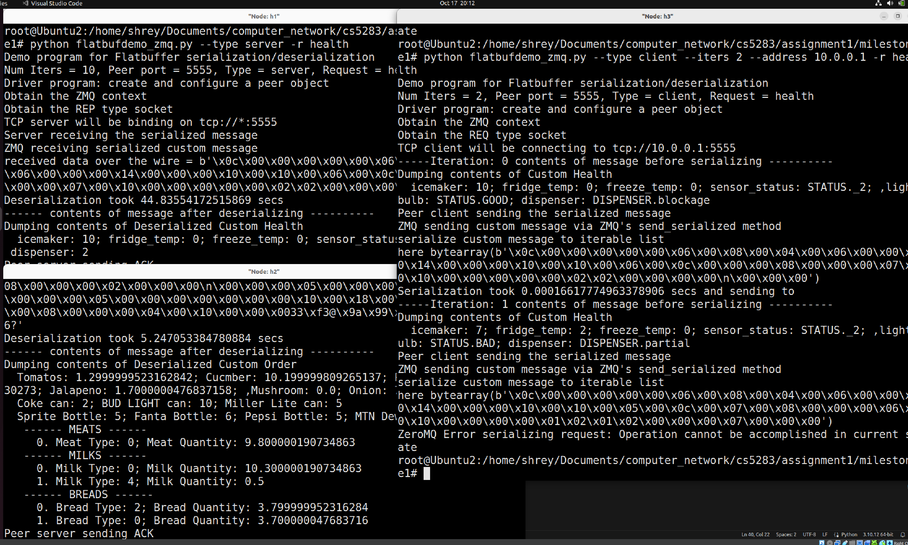
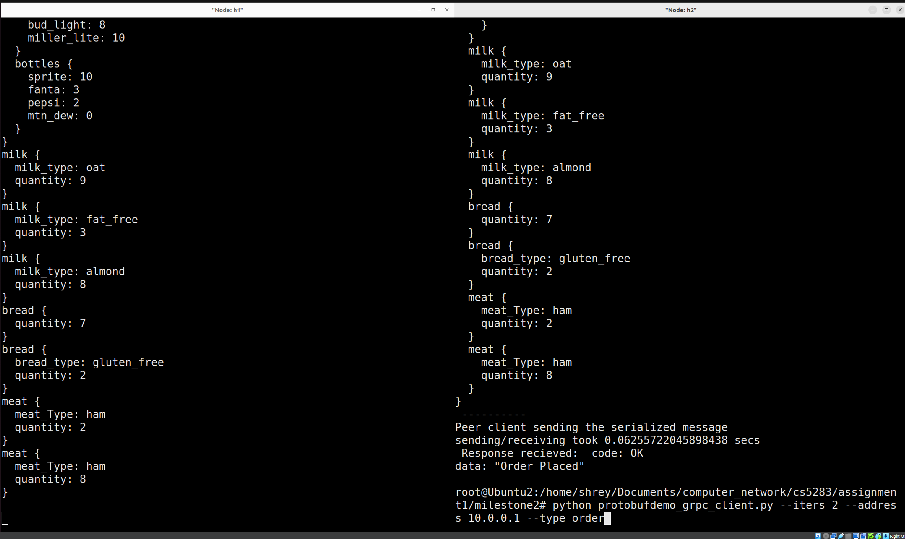

# CS5383: Computer Networks - Programming Assignment #1

**Instructor**: Aniruddha Gokhale  
**Vanderbilt University, Fall 2023**  
**Team Members**: 
- Shrey Patel
- Nelson Torres
- Justin Sumner

## Introduction

This project is a part of the CS5383 course at Vanderbilt University for the Fall 2023 semester. The objective of this assignment is to create a client-server networking solution that leverages a custom Application Protocol. This protocol will operate on top of both gRPC and ZeroMQ communication frameworks. Serialization will be handled through two primary mechanisms - Protobuf and Flatbuffers.

Please follow the instructions below to set up and test the project.

## Screenshots




---

## Setup and Installation

1. **Clone the Repository**

```
git clone git@github.com:shreyVanderbilt/cs5283.git
```

2. **Navigate to the Project Directory**

```
cd cs5283
```
 

3. **Install Dependencies**

```sudo apt-get install python3-pip
pip3 install flatbuffers
pip3 install numpy
pip3 install zmq 
```

4. **Run the Application: Flatbuffer**
    1. Launch mininet
        ```
        sudo mn
        ```
    2. xterm h1
        ```
        xterm h1
        ```
    3. xterm h2
        ```
        xterm h2
        ```
    4. On h1 xterm
        1. Run "ifconfig" - Note the first inet value -> usually 10.0.0.1
            ```
            ifconfig
            ```
        2. Run the server
            ```
            python flatbufdemo_zmq.py -t server
            ```
    5. On h2 xterm
        1. Run the client
            ```
            python flatbufdemo_zmq.py -i 1 --type client  --address 10.0.0.1 --iters 1
            ```
        2. Replace `10.0.0.1`` with inet value from 4-1
        3. Change "--iters 1" to how many orders you want to serialize and deserialize
    6. Check xterm h1 for order deseralization

5. **Run the Application: Protobuf**
    1. Server (h1):
        1. Run "ifconfig" - Note the first inet value -> usually 10.0.0.1
            ```
            ifconfig
            ```
        2. Run the server
            ```
            python protobufdemo_grpc_server.py
            ```
    2. Client (h2):
        1. Run the client
            ```
            python protobufdemo_grpc_client.py --iters 2 --address 10.0.0.1 --type order
            ```
        2. Set type to order or health depending on type of message you want sent
        3. Change address to inet value and iters to number of orders/health request

## Deploying to Kubernetes

#### NOTE: The following instructions assume that you have followed the docker and kubernetes install and set up instructions provided in the [DIY_SelfStudy Box folder](https://vanderbilt.app.box.com/s/s50tqmzy6tb8kqp88c1up27eej9ssytf) provided for this course

All commands intended to be executed in a bash terminal are shown in a **bold** typeface.

### Setup


1. **cd ./milestone3**
2. Configure your kubernetes instance<sup>1</sup>
    1. **sudo cp ./config.toml /etc/containerd/config.toml**
    2. **sudo systemctl restart containerd.service**
    3. **sudo systemctl restart docker.service**
3. Clean up any existing instances
    1. **stop_k8s.sh**<sup>2</sup>
4. Start the local kubernetes instance
    1. **start_k8s.sh**
        1. The start script requires the hostname of the system. This command will fail if the hostname has any capital letters in its name. In this case, a workaround is to hardcode the hostname in place of the *${HOSTNAME}* environment variable.
5. Verify success
    1. **kubectl get nodes**
    
    

### Building Images

Inside the /milestone3/src/ directory there are 2 directories. One is for the flatbuffer+zmq application and the other is for protobuf+grpc. Each directory contains a Dockerfile for building the application images. This can be done by running **docker build -t [SOME TAG NAME] .** in the same directory as the Dockerfile. For example, to build the docker image for protobuf+grpc, perform the following steps:

1. **cd /milestone3/src/protobuf**
2. **docker build -t protobuf-local .**
3. Verify success by running **docker images**. Output should look like the following.


### Creating Namespaces
1. **kubectl create namespace protobuf-grpc-local**
2. **kubectl create namespace flatbuf-zmq-local**
3. Verify by running **kubectl get namespaces**


### Deploying Images
Convenience scripts are provided for deploying and cleaning up pods in /milestone3/src/flatbuf/ and /milestone3/src/protobuf/. In both cases, **start_pods.sh** will deploy the container images to k8s and **cleanup_pods.sh** will delete them.


### Issues Encountered
We were never able to get the deployed container images to actually get pulled despite the fact they were built successfully and were visible when executing **docker images**. We would greatly appreciate any feedback regarding how we could have overcome these issues.


### Footnotes

<sup>1</sup> If your local kubernetes cluster uses a config.toml file different from the one provided in this repo, I cannot guarantee you will be able to deploy successfully

<sup>2</sup> All shell scripts will require executable privileges. This can be done by running **chmod +x [SOME SCRIPT]**
